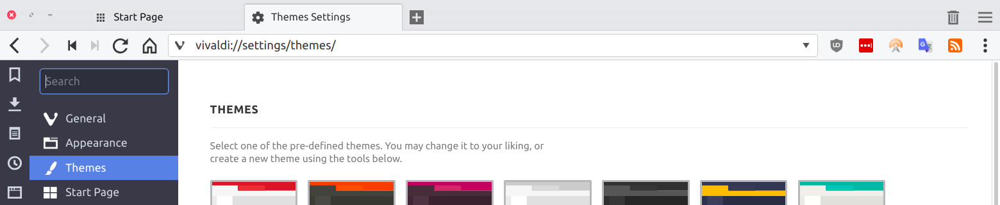
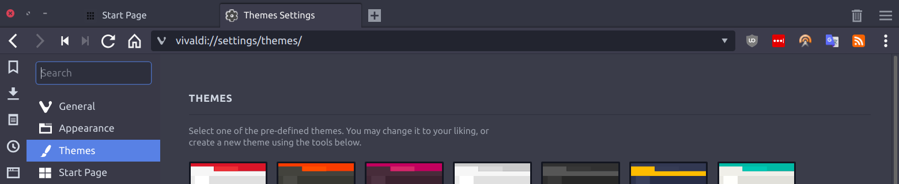

# Arc-for-Vivaldi  

Arc for Vivaldi is a set of custom css files that integrate Vivaldi's UI with [Arc](https://github.com/NicoHood/arc-theme), a popular GTK theme. Rework of Tiamarth's [original theme](https://github.com/Tiamarth/Arc-for-Vivaldi) for Vivaldi.

## Screenshots:

 

## Features:

- Use Arc's window buttons even when Native Window is disabled in the settings (optional)
- Make tab stack indicators Arc-blue, like running application indicators
- Use Arc's scrollbars
- Use Arc's sidebar color even on light themes, unless using the opera panel addon
- Use Arc's toolbar color for start page navigation
- Remove Vivaldi's header gradient.
- Hide Vivaldi's built-in titlebar when GUI is hidden
- When tabs are not at the top of the window, merge address bar with header
- Optionally make the panel appear to merge with the Vivaldi menu icon, similar to Opera's panel

## Installation

Find the `style` folder in your Vivaldi install directory. It should be in the following places depending on your platform:

**Linux:** `/opt/vivaldi/resources/vivaldi/style`  
**Windows:** `C:\Users\[username]\AppData\Local\Vivaldi\Application\[version]\resources\vivaldi\style`  
**Mac:** `/Applications/Vivaldi.app/Contents/Versions/[version]/Vivaldi Framework.framework/Resources/vivaldi/style`

To **integrate with Arc,** save `arc.css` in the `style` folder (you should be left with a folder structure like this: `resources/vivaldi/style/arc.css`).  
Then open `resources/vivaldi/browser.html` in a text and add the following to `<head>`  
`<link rel="stylesheet" href="style/arc.css" />`

### Arc Theme Colors

This custom CSS integrates settings in Vivaldi's built-in theme editor (the custom CSS is necessary to integrate with Arc because you cannot currently customize every aspect of Vivaldi from the editor).  
Settings for Vivaldi's built-in theme editor:

| Arc Theme              | Arc Dark Theme         | Arc Darker Theme       |
| -------------------------------- | -------------------------------- | -------------------------------- |
| Background: #f6f7f8              | Background: #2f343f              | Background: #f5f6f7              |
| Foreground: #333333              | Foreground: #d3dae3              | Foreground: #7a8b94              |
| Highlight: #5294e2               | Highlight: #5294e2               | Highlight: #5294e2               |
| Accent: #e7e8eb                  | Accent: #383c4a                  | Accent: #2f343f                  |
| [x] Apply Accent Color to Window | [ ] Apply Accent Color to Window | [x] Apply Accent Color to Window |
| [x] Transparent Tabs             | [x] Transparent Tabs             | [x] Transparent Tabs             |
| Corner Rounding: 3px             | Corner Rounding: 3px             | Corner Rounding: 3px             |

### Opera Panel Addon

If you want to **use the opera panel addon,** save `opera-panel.css` in the same folder as `arc.css` and then open `browser.html` again and add `<link rel="stylesheet" href="style/opera-panel.css" />` under the code from the first step.

### Arc Window Buttons

If you want to **use the Arc window buttons** instead of Vivaldi's default window buttons, save `arc-window.css` and the `arc` folder in `style` as well. Then open `browser.html` again and add `<link rel="stylesheet" href="style/arc-window.css" />` under the code from the first step.

### Arc Scrollbars

Arc's scrollbars only get applied to internal pages and, as far as I know, there's nothing I can do about that from within a custom css file for Vivaldi. A userstyle by Tiamarth that you can use to apply the scrollbars on websites can be found [here](https://userstyles.org/styles/142645/arc-scrollbars).

**Need more help?** [Create an issue here on GitHub](https://github.com/drakkar1969/Arc-for-Vivaldi/issues/new)

## Todo

- [x] Redo bookmark toolbar button hover/active states
- [x] Fix extension toolbar buttons/badges
- [x] Addressbar + dropdown fonts/colors
- [x] Redo window buttons (zoom + spacing)
- [ ] Check tab stack/selection formatting
- [ ] Check window button overlap with addressbar when tabs not on top

----

[AFV thread on the Vivaldi forums](https://forum.vivaldi.net/post/137297)  
