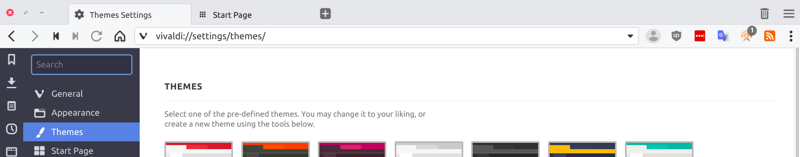
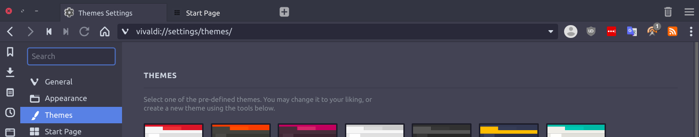
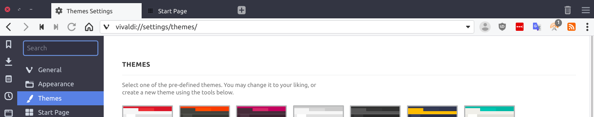

# Arc-for-Vivaldi  

Arc for Vivaldi is a set of custom css files that integrate Vivaldi's UI with [Arc](https://github.com/NicoHood/arc-theme), a popular GTK theme. Rework of Tiamarth's [original theme](https://github.com/Tiamarth/Arc-for-Vivaldi) for Vivaldi.

## Screenshots:

 

 

## Features:

- Use Arc's window buttons even when Native Window is disabled in the settings (optional)
- Make tab stack indicators Arc-blue, like running application indicators
- Use Arc's scrollbars
- Use Arc's sidebar color even on light themes
- Use Arc's toolbar color for start page navigation
- Remove Vivaldi's header gradient
- When tabs are not at the top of the window, merge address bar with header

## Installation

Find the `style` folder in your Vivaldi install directory, which should be in the following location: `/opt/vivaldi/resources/vivaldi/style`.  

To **integrate with Arc,** save `arc.css` in the `style` folder (you should be left with a folder structure like this: `resources/vivaldi/style/arc.css`). Then open `resources/vivaldi/browser.html` in a text and add the following to `<head>`  
`<link rel="stylesheet" href="style/arc.css" />`

This custom CSS integrates settings in Vivaldi's built-in theme editor (the custom CSS is necessary to integrate with Arc because you cannot currently customize every aspect of Vivaldi from the editor).  

Settings for Vivaldi's built-in theme editor:

| Arc Theme                         | Arc Dark Theme                    | Arc Darker Theme                  |
| --------------------------------- | --------------------------------- | --------------------------------- |
| Background: #f6f7f8               | Background: #383c4a               | Background: #f6f7f8               |
| Foreground: #333333               | Foreground: #d3dae3               | Foreground: #333333               |
| Highlight: #5294e2                | Highlight: #5294e2                | Highlight: #5294e2                |
| Accent: #e7e8eb                   | Accent: #2f343f                   | Accent: #2f343f                   |
| [ ] Accent Color from Active Page | [ ] Accent Color from Active Page | [ ] Accent Color from Active Page |
| [x] Apply Accent Color to Window  | [x] Apply Accent Color to Window  | [x] Apply Accent Color to Window  |
| [x] Transparent Tabs              | [x] Transparent Tabs              | [x] Transparent Tabs              |
| Corner Rounding: 3px              | Corner Rounding: 3px              | Corner Rounding: 3px              |

**Note**: *Arc's scrollbars only get applied to internal pages and, as far as I know, there's nothing that can be done about that from within a custom css file for Vivaldi. A userstyle by Tiamarth to apply Arc scrollbars on websites can be found [here](https://userstyles.org/styles/142645/arc-scrollbars)*.  

**Need more help?** [Create an issue here on GitHub](https://github.com/drakkar1969/Arc-for-Vivaldi/issues/new)

### Arc Window Buttons

If you want to **use the Arc window buttons** instead of Vivaldi's default window buttons, save `arc-window.css` and the `arc` folder in `style` as well. Then open `browser.html` again and add `<link rel="stylesheet" href="style/arc-window.css" />` under the code from the first step.

### Custom Accent Color

If you are using a custom version of the Arc theme(s) that uses an accent color that is different from the standard Arc blue (#5294e2), just change the `Highlight` color in the table above to your preferred color.

## Todo

- [ ] Tab strip (tabs left/right)

----

[Original AFV thread on the Vivaldi forums](https://forum.vivaldi.net/post/137297)  
